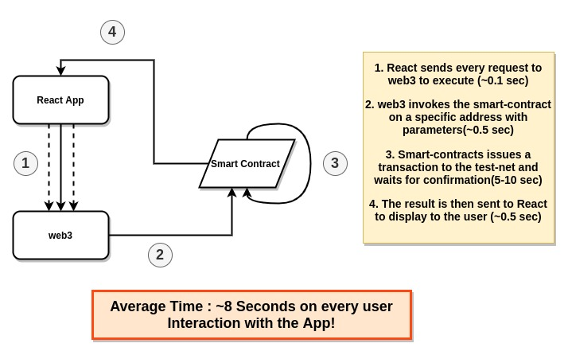
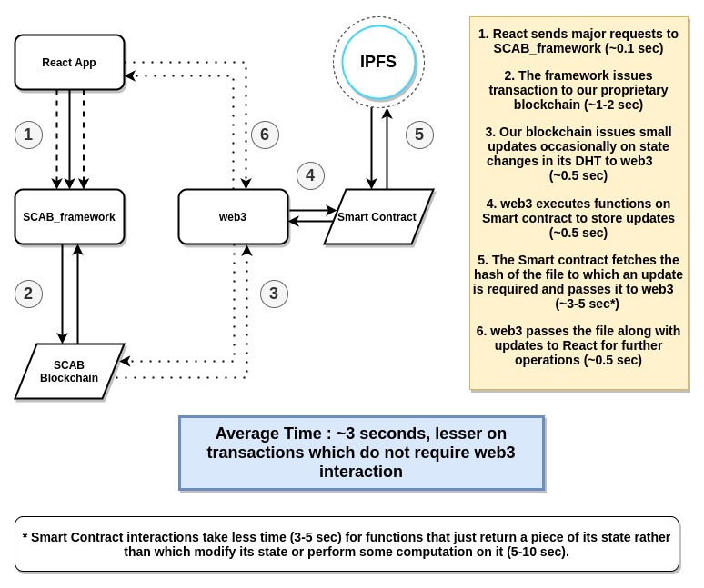
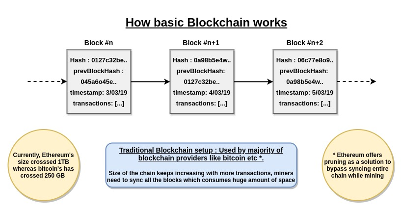
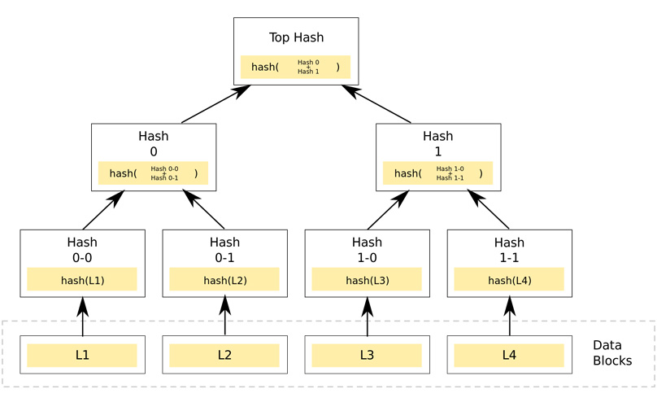

# SCAB_blockchainFramework

Self Compressing Activity Based Blockchain!

---

## Introduction 

This framework was inspired by the intriguing experiences and the various shortcomings that we faced while building a Decentralized Application (D-app) through the use of public blockchains, more specifically a combination of React with Ethereum(web3). 

The whole premise of even thinking of making this framework was to address certain issues, if not completely but partially such as:

* Speed
* Compatibility
* Reliance on web3
* Size

This framework utilizes technologies like Node.js, solidity, ethereum test-net, IPFS and web3.

## The problem with web3 and Smart-Contracts

When working on a React project with web3 as its sole provider of carrying out user interactions on each button click, it soon becomes cumbersome to a user who is using the app and gives a wrong impression to the user about the perceived speed of blockchain transactions versus the actual speed of their transactions going through the test-net, in our case the Rinkeby test-net, and the result showing on the page.

Dealing with page load times right after or before a transaction, the user is often  expecting a small amount of waiting time since even in traditional transactions it takes a few seconds to process them when using VISA or MasterCard portals. The real issue is when the user experiences delays in doing basic tasks which majorly involve executing CRUD operations on their data. This delay can be attributed to the fact that when user's data is stored on the Smart-contract, every operation other than READ is processed as a transaction as it modifies the state of the blockchain and will be sent to the test-net to get processed in a block. The wait time for the block to get processed averages around 10-15 sec depending on block difficulty and number of nodes in the test-net.

User's nowadays are used to performing multitude of CRUD operations within a small amount of time since that data is stored in a centralized space but with blockchain, anything other than waiting for some ether or bitcoin to get transferred seems like unreasonable due to how we have gotten used to traditional systems.

## Decoupling components and Load Sharing

It is clear to anyone using web3 that not all operations should be executed by it, specially the ones that take more than 5 seconds as it really hampers the user experience.

Our approach to this problem was decoupling the time-consuming operations to proprietary blockchain that is specialized to handle CRUD operations rather than relying entirely on web3 and Smart-contracts to store and update its state.

For example, we have used this framework to design a decentralized blockchain store from which people can buy and sell products using Ethereum as its currency. To achieve this goal, we designed a state based transaction system through which every user interaction is recorded as a transaction and once the pending transactions are mined in a block, the state changes and issues updates to our API Server which hosts the database as well as informs web3 of any user updates that are required.

The Load Sharing aspect of this project comes from the fact that the majority of the transactions which relate to changing state of the user's or the store's database are done via our framework which cuts down the average time to process these transactions by 3 times when compared to the traditional way of executing them using web3 and Smart-Contracts.

## Compressing blocks to reduce chain size

Blockchain size is becoming an increasingly concerning and debatable topic. As of writing this document, the bitcoin blockchain size has crossed 250 GB and Ethereum's chain, which is growing 3 times faster than the prior one, has crossed 1 TB in size. 

There have been some methods to tackle this situation of syncing the whole chain like pruning offered by Ethereum developers which allows nodes to download part of the chain and still be qualified as a node that can accept transactions and mine blocks but no such solution is offered by bitcoin since they rely on the UTXO model to prevent double spending rather than state based model. This makes them reliant on the whole chain and increases the requirements to become a miner.

We have adopted a hybrid solution in our framework where we divide the duties to two separate chains rather than relying on one :

* **Payments** : Handled by Ethereum and Smart-Contracts

* **Database/Information management** : Handled by SCAB's blockchain along with using IPFS as a decentralized storage solution

In our framework we have implemented a functionality which allows us to compress the blocks into a hash using IPFS and store them on subsequent blocks which helps to maintain the chain size while preventing measures like pruning or forking the chain in order to shorten it. Since our payments are handled by Ethereum, we don't need to rely on information about double spending of users and can focus solely on maintaining a global state using a hashmap that scans the mined blocks and issues updates accordingly to the desired destinations.

An example of this functionality can be that we maintain a persistent database using out API server and all the transactions relating to CRUD operations are first mined into blocks and then correspondingly updates the hashmap which then in turns puts out a PUT/PATCH request to our API to update our database. This flow could also be directed towards web3 where the framework would publish updates directly to the Smart-contract and the contract would then update its state either by itself or handing over the list of updates to a third-party like React.

## Proof of Activity

Our approach towards a consensus algorithm was an algorithm that takes advantage of the number of active participants in the blockchain while also not over burdening them with high mining requirements that lead to problems when running on constrained devices which power, bandwidth and storage restrictions.

Since we view this framework as a hybrid combination of private and public blockchain implementations, algorithms like PoW(Proof of work) and pBFT would be on the extreme ends of our target category. We wanted to have scalability and minimal governance as well as make it secure and hard for attackers to take over the system by just sheer computational power. These were some algorithms that came in that middle category of not being too computationally expensive and also not too easy to break:

* **Proof of Authority(PoA)** - Since validators needed to know each other, we could not use it in our scenario.

* **Proof of Elapsed Time(PoET)** - Requires special hardware so not suitable.

* **Proof of Importance(PoI)** - Our users differ into two categories so can't give higher importance to one and lower to the other

We came to the conclusion that we needed the presence of our users on our network as a proof of mining the block. In order to achieve this we came up with the concept of merkle tree and decided that in addition to storing the current hash and previous block hash we'll also store the merkle root hash of public keys of random n number of active users on the network at that moment. These parameters will then be hashed by either the network nodes or user nodes who have volunteered to participate to mine.

A merkle tree root hash of all blocks in the chain will also be maintained and synced not only during mining the blocks but also during regular intervals as a way to discourage potential attackers trying to alter the blockchain by taking control of massive amount of computational power.

